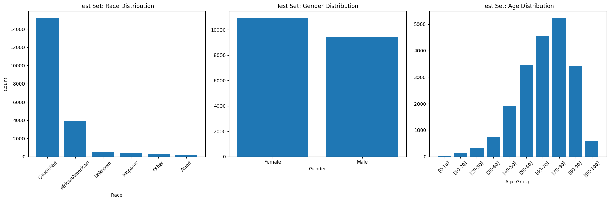
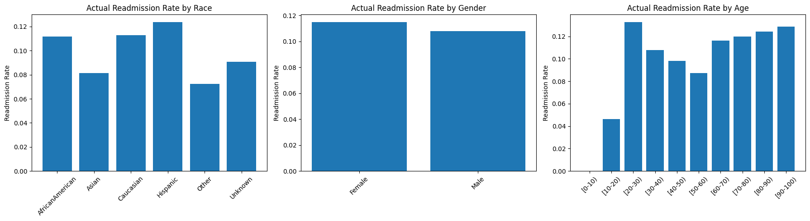
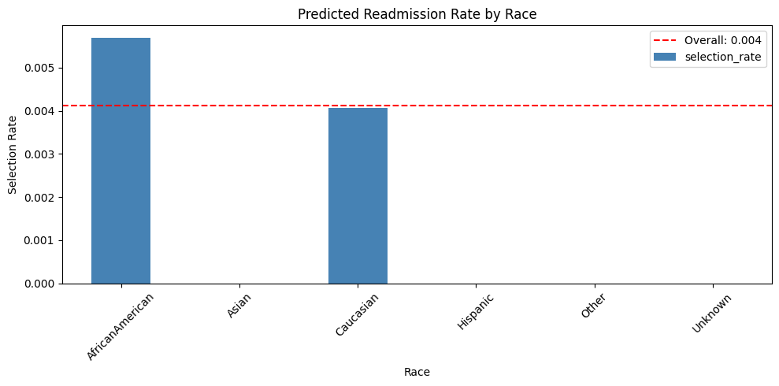
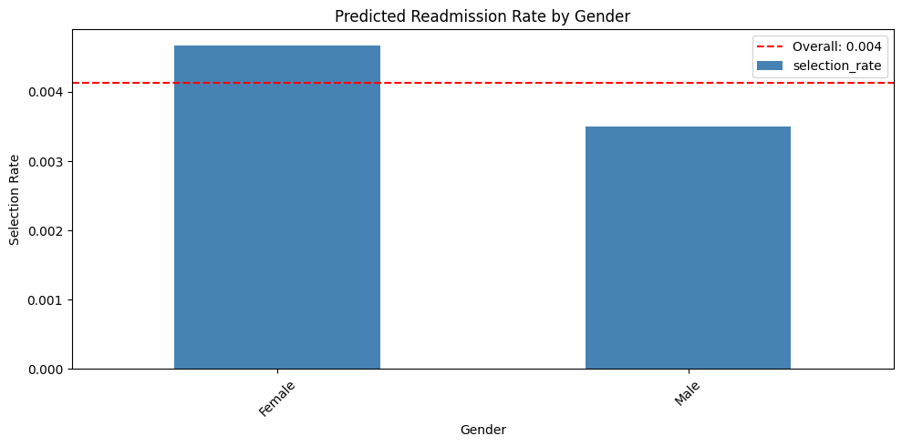
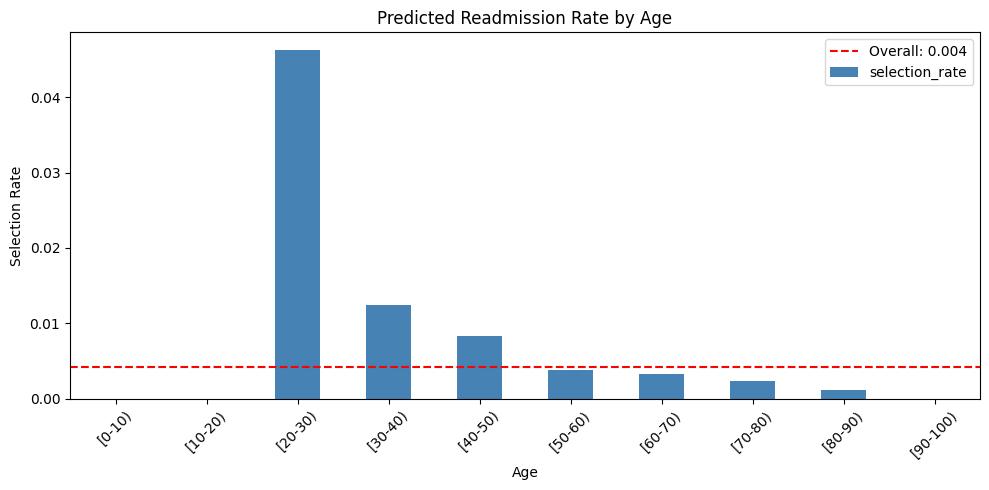
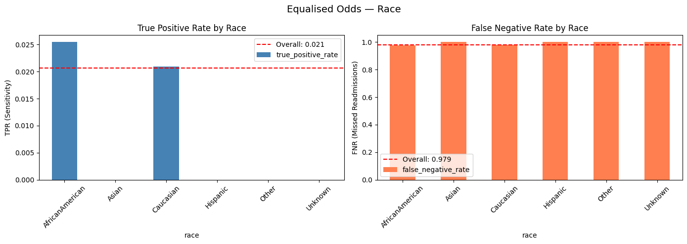
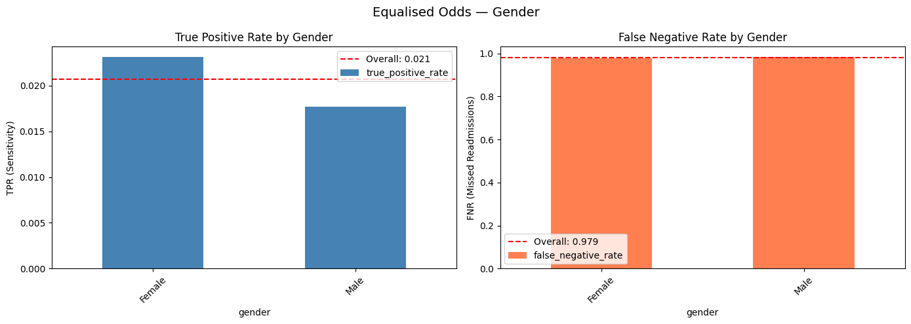
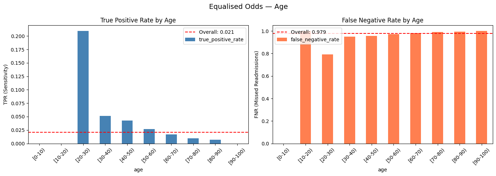
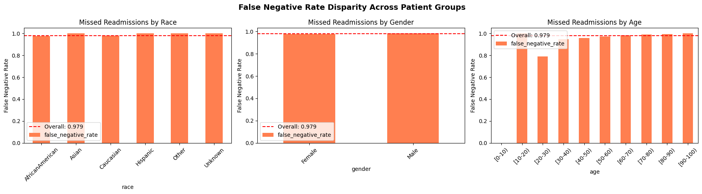
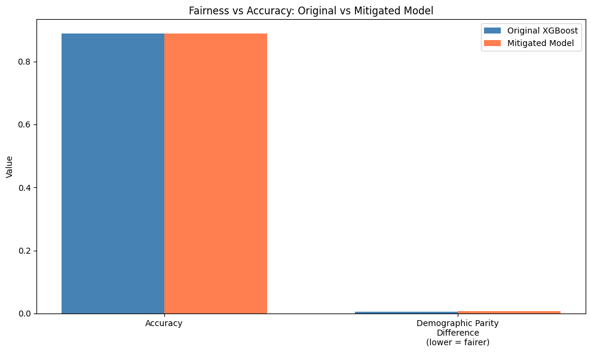

# ⚖️ Fairness Audit of a Healthcare ML Model

A comprehensive fairness audit of a hospital readmission prediction model, examining whether the model treats all patient groups equitably across race, gender, and age — and applying bias mitigation to address identified disparities.

---

## Why This Matters

A machine learning model that achieves strong overall performance may still systematically fail specific patient groups. In healthcare, this isn't just a technical concern — it's a patient safety issue. A model that misses readmissions more often for elderly patients or minority racial groups could lead to unequal clinical intervention, reinforcing existing healthcare disparities.

This project directly addresses requirements emerging from the **EU AI Act (2024)**, which classifies healthcare AI as high-risk and mandates fairness assessments before deployment. Similar expectations are growing within **NHS AI governance frameworks** in the UK.

---

## Project Overview

This audit builds on the [Hospital Readmission Predictor](https://github.com/TochiOkafor/hospital-readmission-predictor) (Project 1), taking the trained XGBoost model and subjecting it to a structured fairness analysis using **Fairlearn** — Microsoft's open-source responsible AI toolkit.

**Sensitive attributes audited:** Race, Gender, Age

**Fairness metrics applied:**
- Demographic Parity Difference
- Equalised Odds (TPR and FNR across groups)
- False Negative Rate Disparity (clinically most critical)

**Mitigation strategy applied:** Exponentiated Gradient with Equalised Odds constraint (Fairlearn)

---

## Dataset

**Source:** [UCI Diabetes 130-US Hospitals (1999–2008)](https://archive.ics.uci.edu/dataset/296/diabetes+130-us+hospitals+for+years+1999-2008)

- 101,766 patient encounters across 130 US hospitals
- Target: binary readmission within 30 days
- Sensitive attributes: Race (6 categories), Gender (2 categories), Age (10 decade groups)

---

## Demographic Distribution of Test Set

The test set is heavily skewed toward Caucasian patients (~15,000) compared to African American (~4,000) and all other racial groups combined. This representational imbalance is itself a fairness concern — models trained on imbalanced data often generalise poorly to underrepresented groups.

---

## Actual Readmission Rates by Group (Ground Truth)

Before examining model predictions, it is important to understand whether disparities exist in the underlying data. Key observations:

- **Hispanic patients** had the highest actual readmission rate (~12.5%) while **Other race** had the lowest (~7%)
- **Gender differences** were minimal — Female (~11.5%) vs Male (~11%)
- **Age disparities** were notable — patients aged [20-30] had the highest readmission rate (~13%), while [10-20] had the lowest (~4.5%)

These data-level disparities provide important context for interpreting model behaviour.

---

## Fairness Audit Results

### Demographic Parity — Predicted Readmission Rates

Demographic parity asks whether the model predicts readmission at similar rates across groups. The overall selection rate was just **0.41%** — the model predicted very few patients as readmitted, reflecting its known weakness in identifying the minority class.

**By Race:**

Only African American (0.57%) and Caucasian (0.41%) patients received any positive readmission predictions. Asian, Hispanic, Other, and Unknown race groups received zero positive predictions — a significant equity concern.

- **Demographic Parity Difference (Race): 0.0057**

**By Gender:**

Female patients were predicted readmitted at a slightly higher rate (0.47%) than Male patients (0.35%).

- **Demographic Parity Difference (Gender): 0.0012**

**By Age:**

The [20-30] age group had a dramatically higher predicted readmission rate (4.6%) compared to all older groups, which were predicted at rates close to zero. Patients aged [0-10] and [90-100] received no positive predictions at all.

- **Demographic Parity Difference (Age): 0.0463** — the largest disparity across all sensitive attributes

---

### Equalised Odds — TPR and FNR by Group

Equalised odds requires the model to have similar True Positive Rates (sensitivity) and False Negative Rates across groups. The FNR is clinically the most critical metric — it represents patients who **will** be readmitted but are not flagged for intervention.

**By Race:**

| Race | TPR | FPR | FNR |
|---|---|---|---|
| AfricanAmerican | 0.0255 | 0.0032 | 0.9745 |
| Asian | 0.0000 | 0.0000 | 1.0000 |
| Caucasian | 0.0210 | 0.0019 | 0.9790 |
| Hispanic | 0.0000 | 0.0000 | 1.0000 |
| Other | 0.0000 | 0.0000 | 1.0000 |
| Unknown | 0.0000 | 0.0000 | 1.0000 |

The model only detected readmissions for African American and Caucasian patients. For all other racial groups, the FNR was 1.0 — meaning **100% of actual readmissions were missed**.

**By Gender:**

| Gender | TPR | FPR | FNR |
|---|---|---|---|
| Female | 0.0231 | 0.0023 | 0.9769 |
| Male | 0.0177 | 0.0018 | 0.9823 |

Gender differences were relatively small, though both groups had near-total FNRs (>97%).

**By Age:**

| Age Group | TPR | FNR |
|---|---|---|
| [0-10] | 0.0000 | 0.0000 |
| [10-20] | 0.0000 | 1.0000 |
| [20-30] | 0.2093 | 0.7907 |
| [30-40] | 0.0513 | 0.9487 |
| [40-50] | 0.0426 | 0.9574 |
| [50-60] | 0.0266 | 0.9734 |
| [60-70] | 0.0170 | 0.9830 |
| [70-80] | 0.0096 | 0.9904 |
| [80-90] | 0.0071 | 0.9929 |
| [90-100] | 0.0000 | 1.0000 |

Age showed the most striking disparity. The [20-30] group had a TPR of 0.2093 — far above any other group. The model's ability to detect readmissions worsened consistently with age, meaning elderly patients — who carry the highest clinical risk — received the least protection from the model.

---

### False Negative Rate Disparity Summary

The overall FNR was **0.979**, meaning the model missed approximately **97.9% of all actual readmissions** across all groups. This is consistent with findings from Project 1 and reflects a fundamental limitation of the base model, not a fairness issue in isolation.

---

## Complete Fairness Audit Summary

| Sensitive Attribute | Demographic Parity Difference | Equalised Odds Difference | Assessment |
|---|---|---|---|
| Race | 0.0057 | 0.0255 | ✅ Within acceptable range |
| Gender | 0.0012 | 0.0054 | ✅ Within acceptable range |
| **Age** | **0.0463** | **0.2093** | ⚠️ Significant disparity |

---

## Bias Mitigation

Applied **Exponentiated Gradient** from Fairlearn with an **Equalised Odds** constraint, using Logistic Regression as the base estimator and targeting race as the primary sensitive attribute.

### Mitigation Results

| Metric | Original XGBoost | Mitigated Model |
|---|---|---|
| Accuracy | 0.8889 | 0.8884 |
| AUC-ROC | 0.6752 | 0.5054 |
| Demographic Parity Difference (Race) | 0.0057 | 0.0081 |

### Interpretation

While overall accuracy remained nearly unchanged, the AUC-ROC dropped significantly from 0.6752 to 0.5054 — approaching random chance. The Demographic Parity Difference for race also slightly increased rather than improving, suggesting the mitigation strategy did not achieve its targeted fairness goal in this configuration.

This highlights a critical lesson in responsible AI: **bias mitigation is not guaranteed to improve all fairness metrics simultaneously**, and the choice of mitigation strategy, base model, and fairness constraint requires careful iterative experimentation.

---

## Key Takeaways

1. **The model's most critical failure is universal, not group-specific** — a near-100% FNR across all groups indicates the base model struggles to identify readmissions regardless of demographic group
2. **Age is the most significant source of fairness disparity** — the Equalised Odds Difference of 0.2093 for age far exceeds race and gender, with younger patients far better served by the model
3. **Race representation in predictions is highly unequal** — four of six racial groups received zero positive predictions, meaning zero interventions for those populations in a clinical deployment
4. **Fairness metrics can appear acceptable while masking real harm** — Race and Gender showed small Demographic Parity Differences, yet most minority racial groups had a 100% miss rate on actual readmissions
5. **The fairness-accuracy trade-off is real and context-dependent** — mitigation improved some metrics while degrading others, underscoring the need for domain-specific fairness definitions in healthcare AI

---

## Limitations

- **Dataset age (1999–2008):** Current clinical practice, medication profiles, and demographic patterns have changed significantly. Modern EHR data is not publicly available due to HIPAA and GDPR
- **Single mitigation strategy:** Only Exponentiated Gradient with Equalised Odds was tested. Alternative approaches (reweighing, threshold adjustment, adversarial debiasing) may produce better results
- **Base model weakness:** The high FNR across all groups limits the interpretability of group-level fairness differences
- **US-centric data:** Racial categories and healthcare patterns in this dataset may not generalise to UK NHS populations

---

## 📓 View Notebook

[Click here to view the full notebook](https://nbviewer.org/github/TochiOkafor/healthcare-fairness-audit/blob/main/notebooks/fairness_audit.ipynb)

---
## How to Run

1. Open `notebooks/fairness_audit.ipynb` in [Google Colab](https://colab.research.google.com/)
2. Run all cells in order — no additional data upload required (dataset loads automatically via `ucimlrepo`)

**Dependencies:**

- pandas
- numpy
- matplotlib
- seaborn
- scikit-learn
- xgboost
- imbalanced-learn
- fairlearn
- ucimlrepo

---

## Future Improvements

- Test alternative mitigation strategies: threshold optimisation, reweighing, adversarial debiasing
- Conduct intersectional fairness analysis (e.g. elderly Black female patients)
- Apply fairness constraints during XGBoost training rather than post-hoc
- Produce a formal Model Card documenting fairness findings for clinical stakeholders
- Validate findings against a more recent, representative dataset

---

## Tools & Libraries

